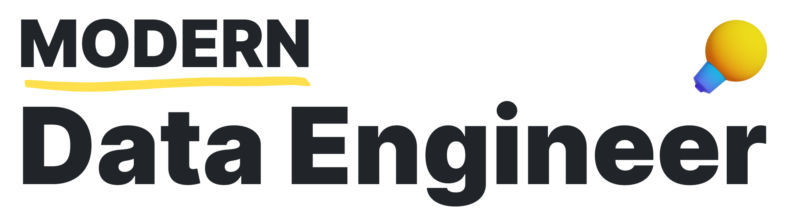
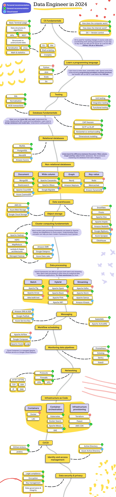
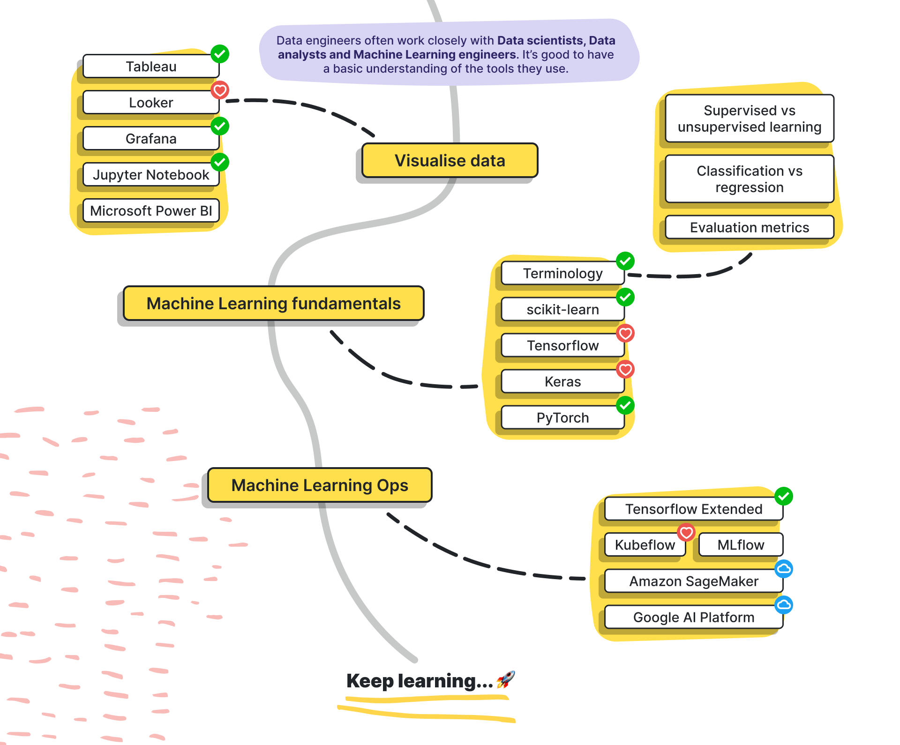

This repository serves as a comprehensive guide for individuals aspiring to become Data Engineers in 2024. It provides a detailed roadmap, recommended learning resources, and a collection of open-source projects to help you develop the necessary skills and gain hands-on experience.

> Roadmap to becoming a data engineer in 2024

***

<h3 align="center"><strong>Note to beginners</strong></h3>

> Beginners shouldn’t feel overwhelmed by the vast number of tools and frameworks listed here. A typical data engineer would master a subset of these tools throughout several years depending on his/her company and career choices.

***

> [Text version for visually impaired users](text/roadmap.md)

## Nice to have 😎

> [Text version for visually impaired users](text/extras.md)

***

## Study Material
This section will provide an overview and reference content to understand  different frameworks and technologies required for Data Engineering field, their importance and the role of becoming a great Data Engineer!

> Node: Some of the below resource links are not working, I am working to update them.

- [Programming Languages](#programming-languages)
  - [Python](#python)
  - [Scala/Java](#scalajava)
- [Data Processing Frameworks](#data-processing-frameworks)
  - [Apache Spark](#apache-spark)
  - [Apache Hadoop](#apache-hadoop)
- [Data Storage and Querying](#data-storage-and-querying)
  - [Databases](#databases)
  - [Data Warehousing](#data-warehousing)
- [Data Streaming and Messaging](#data-streaming-and-messaging)
  - [Apache Kafka](#apache-kafka)
  - [Apache Flink/Apache Storm](#apache-flinkache-storm)
- [Data Orchestration and Workflow Management](#data-orchestration-and-workflow-management)
  - [Apache Airflow](#apache-airflow)
- [Cloud Computing](#cloud-computing)
  - [AWS](#aws)
  - [Azure](#azure)
  - [GCP](#gcp)
- [Data Modeling and ETL/ELT](#data-modeling-and-etlelt)
  - [Data Modeling](#data-modeling)
  - [ETL/ELT](#etlelt)
- [Data Visualization and Reporting](#data-visualization-and-reporting)
- [Soft Skills](#soft-skills)
- [Projects and Certifications](#projects-and-certifications)
- [Interview Preparation](#interview-preparation)
- [Contributing](#Contributing)

## Programming Languages

### Python

- [Python for Data Analysis](https://www.oreilly.com/library/view/python-for-data/9781491957662/) - Free book from O'Reilly covering Python for data analysis.
- [Python Data Science Handbook](https://jakevdp.github.io/PythonDataScienceHandbook/) - Free book that covers the essential knowledge for working with data in Python.
- [Python for Data Analysis Video Series](https://www.youtube.com/playlist?list=PL5-da3qGB5ICCsgW1IHykI9tC7mXXhxmr) - Video tutorials from Corey Schafer.

### Scala/Java

- [Scala Programming Language](https://scala-lang.org/documentation/) - Official documentation and learning resources for Scala.
- [Java Programming Language](https://docs.oracle.com/javase/tutorial/) - Official Java tutorials from Oracle.

## Data Processing Frameworks

### Apache Spark

- [Apache Spark Official Documentation](https://spark.apache.org/docs/latest/)
- [Learning Spark: Lightning-Fast Data Analytics](https://pages.databricks.com/rs/094-YMS-629/images/LearningSpark2.0.pdf) - Free book from Databricks (requires email signup).
- [Spark Programming Guide](https://www.oreilly.com/library/view/spark-programming-guide/9781786462718/) - Book from O'Reilly.

### Apache Hadoop

- [Apache Hadoop Official Documentation](https://hadoop.apache.org/docs/stable/)
- [Hadoop: The Definitive Guide](https://www.oreilly.com/library/view/hadoop-the-definitive/9781491901687/) - Book from O'Reilly.

## Data Storage and Querying

### Databases

- [PostgreSQL Tutorial](https://www.postgresqltutorial.com/) - Free comprehensive PostgreSQL tutorial.
- [MySQL Tutorial](https://www.mysqltutorial.org/) - Free MySQL tutorial for beginners.
- [MongoDB University](https://university.mongodb.com/) - Free online courses and certifications for MongoDB.
- [Apache Cassandra Documentation](https://cassandra.apache.org/doc/) - Official documentation for Apache Cassandra.
- [HBase Reference Guide](https://hbase.apache.org/book.html) - Official reference guide for Apache HBase.

### Data Warehousing

- [Apache Hive Tutorial](https://cwiki.apache.org/confluence/display/Hive/Tutorial) - Official Apache Hive tutorial.
- [Presto Documentation](https://prestodb.io/docs/current/) - Official documentation for Presto.
- [Apache Impala Documentation](https://impala.apache.org/docs/build/) - Official documentation for Apache Impala.

## Data Streaming and Messaging

### Apache Kafka

- [Apache Kafka Documentation](https://kafka.apache.org/documentation/) - Official Apache Kafka documentation.
- [Kafka: The Definitive Guide](https://www.oreilly.com/library/view/kafka-the-definitive/9781491936153/) - Book from O'Reilly.
- [Kafka Streams Documentation](https://kafka.apache.org/documentation/streams/) - Official documentation for Kafka Streams.

### Apache Flink/Apache Storm

- [Apache Flink Documentation](https://nightlies.apache.org/flink/flink-docs-release-1.16/) - Official Apache Flink documentation.
- [Apache Storm Documentation](https://storm.apache.org/releases/current/index.html) - Official Apache Storm documentation.

## Data Orchestration and Workflow Management

### Apache Airflow

- [Apache Airflow Documentation](https://airflow.apache.org/docs/) - Official Apache Airflow documentation.
- [Airflow Tutorial](https://airflow.apache.org/tutorial.html) - Official Airflow tutorial.
- [Mastering Apache Airflow](https://www.oreilly.com/library/view/mastering-apache-airflow/9781492086314/) - Book from O'Reilly.

## Cloud Computing

### AWS

- [AWS Big Data Services](https://aws.amazon.com/big-data/) - Overview of AWS big data services.
- [Amazon EMR Documentation](https://docs.aws.amazon.com/emr/) - Official documentation for Amazon EMR.
- [Amazon S3 Documentation](https://docs.aws.amazon.com/s3/) - Official documentation for Amazon S3.
- [Amazon Athena Documentation](https://docs.aws.amazon.com/athena/) - Official documentation for Amazon Athena.
- [Amazon Redshift Documentation](https://docs.aws.amazon.com/redshift/) - Official documentation for Amazon Redshift.

### Azure

- [Azure Data Services](https://azure.microsoft.com/en-us/product-categories/analytics/) - Overview of Azure data and analytics services.
- [Azure HDInsight Documentation](https://docs.microsoft.com/en-us/azure/hdinsight/) - Official documentation for Azure HDInsight.
- [Azure Data Lake Storage Documentation](https://docs.microsoft.com/en-us/azure/data-lake-store/) - Official documentation for Azure Data Lake Storage.
- [Azure Synapse Analytics Documentation](https://docs.microsoft.com/en-us/azure/synapse-analytics/) - Official documentation for Azure Synapse Analytics.

### GCP

- [Google Cloud Data Services](https://cloud.google.com/products/data-analytics) - Overview of Google Cloud data and analytics services.
- [Google Cloud Dataproc Documentation](https://cloud.google.com/dataproc/docs/) - Official documentation for Google Cloud Dataproc.
- [Google Cloud Dataflow Documentation](https://cloud.google.com/dataflow/docs/) - Official documentation for Google Cloud Dataflow.
- [Google BigQuery Documentation](https://cloud.google.com/bigquery/docs/) - Official documentation for Google BigQuery.

## Data Modeling and ETL/ELT

### Data Modeling

- [Data Modeling for Data Warehouses](https://www.amazon.com/Data-Modeling-Data-Warehouses-Vaughan/dp/1555581167) - Book by Len Silverston and Paul Agnew.
- [Data Vault Modeling Guide](https://www.oreilly.com/library/view/data-vault-modeling/9781119613565/) - Book from O'Reilly.

### ETL/ELT

- [ETL/ELT with Python](https://www.oreilly.com/library/view/etlelt-with-python/9781492047025/) - Book from O'Reilly.
- [Apache NiFi Documentation](https://nifi.apache.org/docs.html) - Official documentation for Apache NiFi.
- [Talend Open Studio Documentation](https://help.talend.com/r/en-US/8.0/) - Official documentation for Talend Open Studio.

## Data Visualization and Reporting

- [Tableau Desktop Resources](https://www.tableau.com/learn/training) - Free training resources for Tableau Desktop.
- [Power BI Documentation](https://docs.microsoft.com/en-us/power-bi/) - Official documentation for Microsoft Power BI.
- [Apache Superset Documentation](https://superset.apache.org/docs/) - Official documentation for Apache Superset.

## Soft Skills

- [Problem-Solving Techniques](https://www.mindtools.com/pages/article/newTMC_00.htm) - Resources for developing problem-solving skills.
- [Effective Communication Skills](https://www.mindtools.com/CommSkll/CommunicationIntro.htm) - Resources for improving communication skills.
- [Collaboration and Teamwork](https://www.mindtools.com/pages/article/newTMM_84.htm) - Resources for enhancing collaboration and teamwork.

## Projects and Certifications

- [AWS Certified Big Data Specialty](https://aws.amazon.com/certification/certified-big-data-specialty/) - AWS Certified Big Data Specialty certification.
- [Azure Data Engineer Associate](https://docs.microsoft.com/en-us/learn/certifications/azure-data-engineer) - Azure Data Engineer Associate certification.
- [Google Cloud Professional Data Engineer](https://cloud.google.com/certification/data-engineer) - Google Cloud Professional Data Engineer certification.

## Interview Preparation

- [Data Engineering Interview Questions](https://data-flair.training/blogs/data-engineering-interview-questions/) - Collection of data engineering interview questions.
- [System Design Interview Questions](https://www.educative.io/courses/grokking-the-system-design-interview) - System design interview questions and resources.

## Contributing

My main motive to setup this repository is to consolidate differeent knowledge sources in one place. I will continue to improve this but I'm also just a human and we live in a world full of evolving technologies. If you have any suggestions, improvements, or additional resources to share, please feel free to contribute to this repository.
